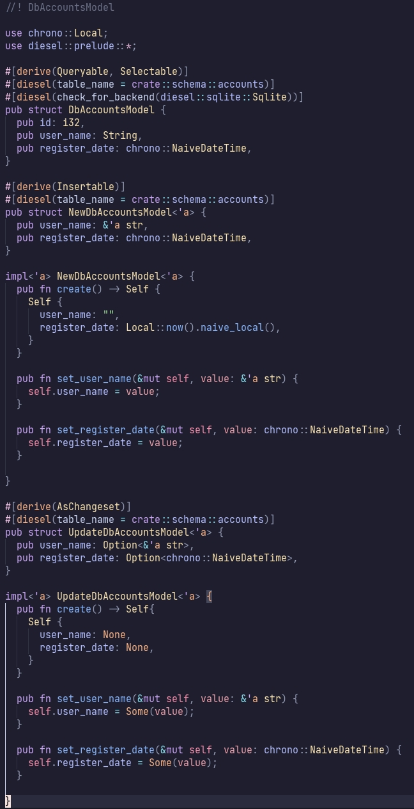
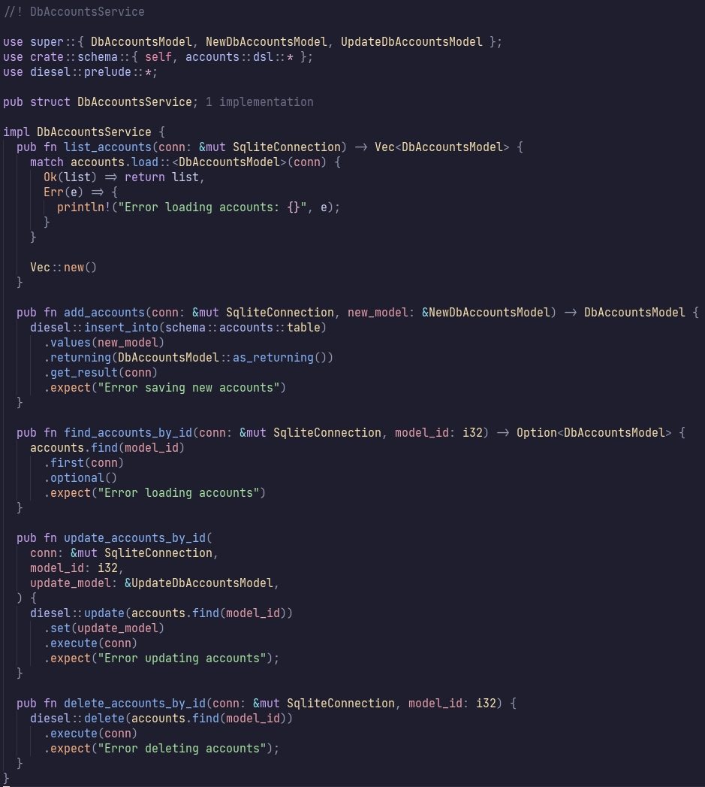

# Diesel Schema Code Generation
A simple Diesel schema.rs code generation script by bash shell.

This is a simple Diesel schema.rs code generation script that can generate rust code stored in a separate folder according to the definition in the scheme

# Useage:
```
./codegen.sh <path to schema.rs> <database code directory>
```

# Run example:
```
git clone https://github.com/loFei/diesel_schema_code_generation.git

cd example

# migration
./diesel_migration_run.sh

# build and run
./run.sh
```

The generated code structure is as follows:

```
src/db/
├── accounts
│   ├── accounts_model.rs
│   ├── accounts_service.rs
│   └── mod.rs
├── mod.rs
└── posts
    ├── mod.rs
    ├── posts_model.rs
    └── posts_service.rs
```
Model code:



Service code:



